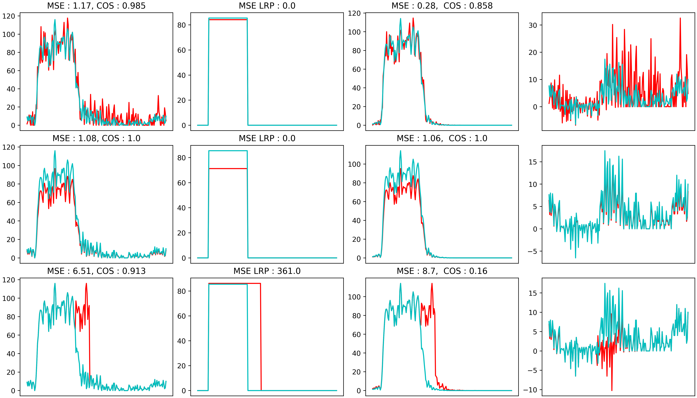
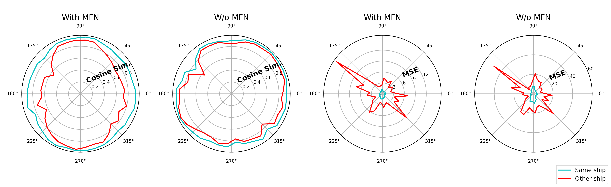

# MFN Decomposition & Metrics for HRRP

This repository provides a **deep-learning-friendly** implementation of the **MFN decomposition**
(**M**ask–**F**eatures–**N**oise) for **High-Resolution Range Profiles (HRRP)**, together with
**decomposition-aware similarity metrics** designed for evaluating **generative models** (and more
generally comparing HRRP signals in a physically meaningful way).

It accompanies the paper:

> **MFN Decomposition and Related Metrics for High-Resolution Range Profiles Generative Models**  
> (Accepted at RadarConf25)

---

## Why MFN?

HRRPs are 1D radar signatures that often contain:
- a **target support** region (where the target “lives” along the range axis),
- **structured low-frequency components** (stable, geometry-driven),
- **high-frequency residuals / clutter** (unstable peaks, noise-like content).

Standard metrics like global MSE or cosine similarity can be dominated by:
- background / empty cells,
- small alignment differences,
- very localized peaks,
- target size effects (different support lengths).

**MFN** decomposes a range profile into interpretable components and enables metrics that focus on
what matters for HRRP comparison.

---

## What’s inside

- `utils.py`  
  Core MFN utilities (decomposition + metric helpers).

- `demo_decomposition.ipynb`  
  A ready-to-run notebook demonstrating MFN decomposition and metric computation.

- `data/ship_hrrp.pt`  
  A small **demo tensor** with **128** HRRP examples of **length 512** (range cells).

- `assets/`  
  Two figures already used by the paper / repo:
  - `assets/examples_decomp.png`
  - `assets/plot_best_wwo_mfn.png`

---

## Visual overview

**MFN decomposition examples**



**Metric behavior (with / without MFN)**

The following figure shows both metrics between two data of the same ship **blue** and two data from different ships **red**.



---

## MFN decomposition

Given a range profile \( RP \in \mathbb{R}^{S} \), MFN builds:

- **m**: a soft **mask** over the *cells of interest* (COI) / target support  
- **f**: a **filtered feature** component (Gaussian-smoothed / low-frequency) inside the support  
- **n**: a **residual** component capturing remaining peaks and noise  
  \[
  n = RP - f
  \]

The goal is not to “denoise everything”, but to separate **robust structure** from **non-robust peaks**
so that evaluation metrics become more consistent and interpretable.

---

## Decomposition-aware metrics

This repo supports comparing signals using MFN outputs, e.g.:

- **MSE on features** (feature-only MSE, optionally normalized by an estimate of target support length)
- **Cosine similarity on features** restricted to the (union of) target supports / COIs

These metrics are designed to be:
- **less sensitive** to empty/background cells,
- **less dominated** by isolated peaks,
- **more meaningful** when comparing same-target vs different-target HRRPs.

---

## Citation

If you use this code, please cite:

```bibtex
@inproceedings{brient_mfn_hrrp,
  title     = {MFN Decomposition and Related Metrics for High-Resolution Range Profiles Generative Models},
  author    = {Brient, Edwyn and Velasco-Forero, Santiago and Kassab, Rami},
  booktitle = {IEEE Radar Conference (RadarConf)},
  year      = {2025}
}
```

### Acknowledgments

This work used HPC resources from GENCI–IDRIS (Grant 2024-AD011014422R1).
